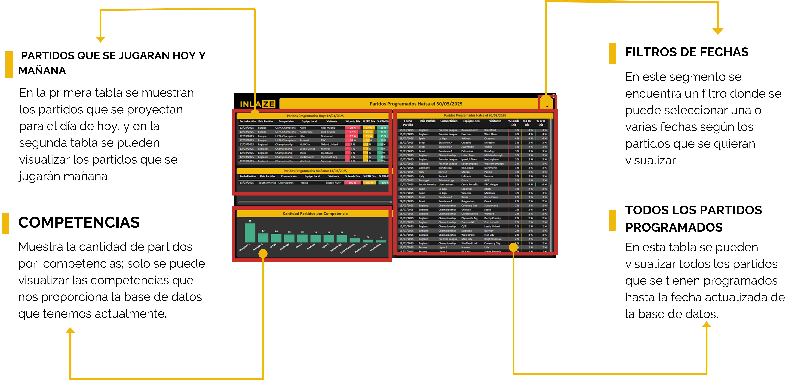

# Manual Partidos Diarios

## índice

- [Manual Programación de Partidos](#manual-reporte-gestores)
  - [índice](#índice)
  - [1. Recursos](#1-recursos)
    - [Aliados de trabajo y herramientas](#aliados-de-trabajo-y-herramientas)
    - [Fuentes de trabajo](#fuentes-de-trabajo)
  - [2. Herramienta](#2-herramienta)
    - [Filtros](#filtros)
    - [Tablas programación de partidos](#tablas-programación-de-partidos)
    - [Ejemplos de filtro ](#ejemplos-de-filtro)
  - [3. Datos a tener en cuenta para las posibles estrategias](#3-datos-a-tener-en-cuenta-para-las-posibles-estrategias)
    - [Conclusiones Competencias](#conclusiones-competencias)
  - [4.Componentes y Reglas del Modelo](#4-componentes-y-reglas-del-modelo)
  - [5. Fuentes](#5-fuentes)
  - [6. Contacto](#5-contacto)

--  

   #### Objetivo del Modelo 
    
    Proyectar indicadores clave de rendimiento (Leads, First-Time Deposits - FTDs, y Cost Per Acquisition - CPA) para eventos de fútbol, basado en datos históricos y factores contextuales. Esto permite predecir el impacto de eventos específicos en el comportamiento de los usuarios en mercados de apuestas como Colombia y Brasil.
    
    

## 1. Recursos

### Aliados de trabajo y herramientas

[índice](#índice)

### Fuentes de trabajo

- La principal fuente de este tablero es la base que nos proporciona una API específicamente de fútbol en la cual encontraremos fechas de futuros partidos. Es de tener en cuenta que el API no es en tiempo real y que tarda en actualizar un promedio de 2 a 3 días las nuevas competencias o nuevos partidos programados según los resultados de cada encuentro.
- La segunda base es el histórico con el que cuenta la compañía, con el cual podemos proyectar las intenciones de apuestas por competencia y equipo usando (Leads, FTD y CPA). 
- Tendencia deportivas, se investiga por competencia cuales son más populares para proyectar una intencion de apuesta más acertada.

[índice](#índice)

## 2. Herramienta

**(Tablero Power BI)**

### Filtros 

Se genera la creación de un filtro flotante por fechas para que se puede seleccionar una o varias fechas según los partidos que se quieran visualizar.adicional ayudara a una forma más rapida de navegacion.

[índice](#índice)

### Tablas programación de partidos

En estas tablas se podrá visualizar los partidos que se juegan hoy, mañana o están próximos a jugar junto con las proyecciones de leads, FTD y CPA que puede causar cada uno.

Es importante que tengan en cuenta que la tabla número 3 que se puede ver en la siguiente imagen está porcentuada de manera general porque están todas las fechas. Esto quiere decir que para ver el impacto puntual de los partidos se debe seleccionar en el filtro la fecha que se quiere validar y así nos dará el porcentaje real de los partidos que se jugarán.

### Ejemplos de filtro 

Esta seria la manera correcta de filtrar para poder visualizar el impacto exacto que puede tener un partido segun la fecha a validar

[índice](#índice)

## 3. Datos a tener en cuenta para las posibles estrategias

**🔹Colombia:** El fútbol representa aproximadamente el 85% del mercado de apuestas en línea. Los eventos más populares incluyen la Copa América, la Champions League, y las principales ligas europeas (Serie A, Premier League, La Liga, Bundesliga). Otros deportes como tenis, boxeo, ciclismo y atletismo constituyen el 15% restante.
 
**🔹Brasil**: El fútbol domina con un 84.2% de las apuestas deportivas, seguido del baloncesto (7.2%) y los eSports (6.1%).

Tendencia de popularidad para las competencias  tanto en Colombia como en Brasil (Estos fueron unos de los porcentajes usados para dimencionar las proyecciones)

### Conclusiones Competencias

Basandonos en algunos articulos e investigaciones podemos concluir que :

**- Premier League (Inglaterra)**

- La liga más vista y apostada en el mundo.
- Equipos como Manchester City, Liverpool, Arsenal y Manchester United generan millones en apuestas.

**-UEFA Champions League**

- La élite del fútbol europeo, con partidos de alto nivel y apuestas masivas.
- Eliminatorias y finales tienen picos enormes de apuestas.

**- La Liga (España)**

- Equipos como Real Madrid y Barcelona atraen muchas apuestas.
- Menos partidos igualados que la Premier, pero sigue siendo muy apostada.

**- Serie A (Italia)**

- Equipos históricos como Juventus, Inter y AC Milan generan interés.
- La liga ha vuelto a ganar popularidad en apuestas en los últimos años.

**- Bundesliga (Alemania)**

- Bayern Múnich domina, pero la competitividad de equipos como Dortmund y  Leverkusen mantiene el interés.
- Liga de muchos goles, lo que favorece apuestas en mercados como "Más de 2.5 goles".

**- Libertadores (Sudamérica)**

- El torneo de clubes más importante de América.
- Apuestas altas en equipos brasileños y argentinos, además de partidos de eliminación directa.

**-Ligue 1 (Francia)**

- Dominada por el PSG, pero con equipos competitivos como Marsella y Mónaco.
- Menos atractiva para apostadores en comparación con otras ligas top.

**-Brasileirão Serie A (Brasil)**

- Liga muy seguida en Sudamérica y Europa, con partidos impredecibles.
- Apuestas populares en goles y tarjetas debido al ritmo intenso del fútbol brasileño.

**-Eredivisie (Países Bajos)**

- Competición ofensiva, ideal para apuestas en goles.
- Equipos como Ajax, PSV y Feyenoord generan mayor volumen de apuestas.

**-Championship (Inglaterra, Segunda División)**

- Torneo con partidos muy parejos, lo que lo hace atractivo para apostadores que buscan cuotas altas.

**-Primeira Liga (Portugal)**

- Equipos como Benfica, Porto y Sporting dominan.
- No es tan apostada fuera de Portugal, pero ofrece buenos mercados.

**- European Championship (Eurocopa) (solo cuando se juega)**

- En años de Eurocopa, las apuestas suben considerablemente.
- Fase de grupos y eliminatorias generan apuestas similares a la Champions.

[índice](#índice)

## 4. Componentes y Reglas del Modelo

**- 1. Segmentación del Mercado y Relevancia de Eventos**
 
 Basado en investigación de mercado, se identificó que el fútbol tiene una participación significativa en las apuestas: 86% en Colombia y 85% en Brasil.
 
 Este dato orienta el modelo a priorizar eventos futbolísticos sobre otros deportes.
 
 
 
**-2. Cálculo de la Fecha del Depósito**
 
Para cada partido, se asume que los depósitos asociados a apuestas ocurren mayoritariamente tres días antes del evento. Este supuesto se basa en tendencias observadas en los datos históricos.
 
 
 
**-3. Modelado de Intención de Conversión**
 
Se analiza el comportamiento histórico de Leads, FTDs y CPA por día en función de los partidos jugados en esas fechas.
 
     Variables clave consideradas:
    
    - Equipos que participaron.
 
    - Localidad del equipo (local o visitante).
 
    - Tipo de competencia (ligas locales, torneos internacionales, etc.).
 
 
El análisis incluye un desglose granular para identificar patrones por equipo y contexto.
 
 
 
**-4. Incorporación de Comportamientos Históricos**
 
    Se evalúa el comportamiento de usuarios con base en:
 
    - Historial de apuestas por equipo.
 
    - Resultados previos de los equipos y su desempeño en la competencia.
 
    - Si el equipo jugó como local o visitante.
 
Esto permite ponderar la intención de conversión de forma más precisa.
 
 
 
**-5. Penalización para Evitar Duplicidad**
 
Para evitar la sobreestimación de Leads y Depósitos, el modelo aplica una penalización (o "castigo") en función de:
 
La popularidad de la competencia en el mercado.
 
El número total de partidos jugados en una misma fecha.
 
 
Esto asegura que las proyecciones reflejen la distribución realista de la demanda.
 
 
 
**-6. Construcción del Árbol de Decisión**
 
    El modelo genera un árbol de decisión que clasifica los eventos con base en:
 
    - Fecha del depósito proyectada.
 
    - Tipo de encuentro (liga local, internacional, amistoso, etc.).
 
    - Competencia específica.
 
    - Condición de los equipos (local o visitante).
 
 
Este árbol se usa para calcular probabilidades ajustadas de conversión (Leads, FTDs) y CPA para cada partido.
  
## 5. Fuentes

- Forbes. (2024, 28 de agosto). Apuestas deportivas crecerán 40% en Colombia este 2024 por cuenta de los grandes eventos. https://forbes.co/2024/08/28/deportes-2/apuestas-deportivas-creceran-40-en-colombia-este-2024-por-cuenta-de-los-grandes-eventos/
- Focusgn. (2024, 9 de julio). Qué porcentaje de las apuestas deportivas en Brasil corresponde al fútbol. https://focusgn.com/latinoamerica/que-porcentaje-de-las-apuestas-deportivas-en-brasil-corresponde-al-futbol

[índice](#índice)

## 6. Contacto

Para sugerencias,dudas o peticiones contactar a el siguiente correo (Equipo BI):

*a.jejen@inlaze.com*

                                                    2025 © Inlaze